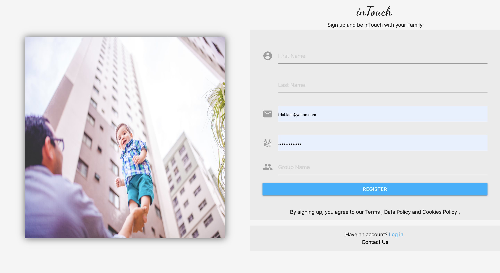
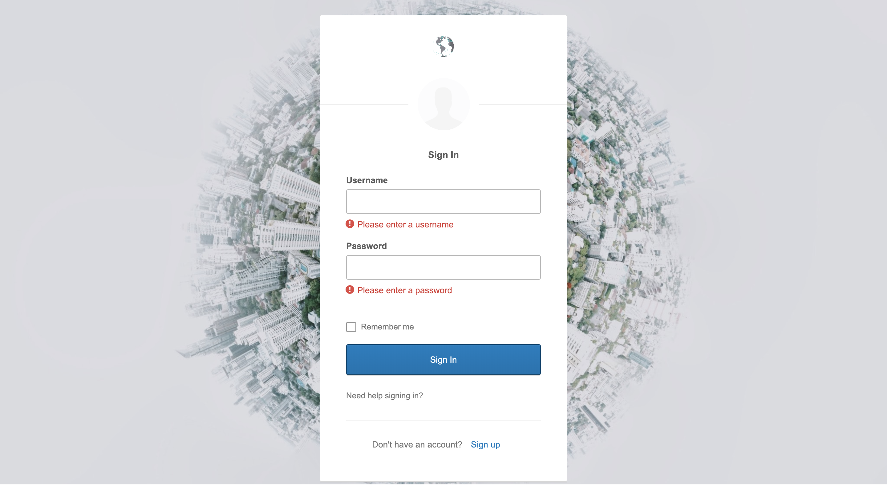
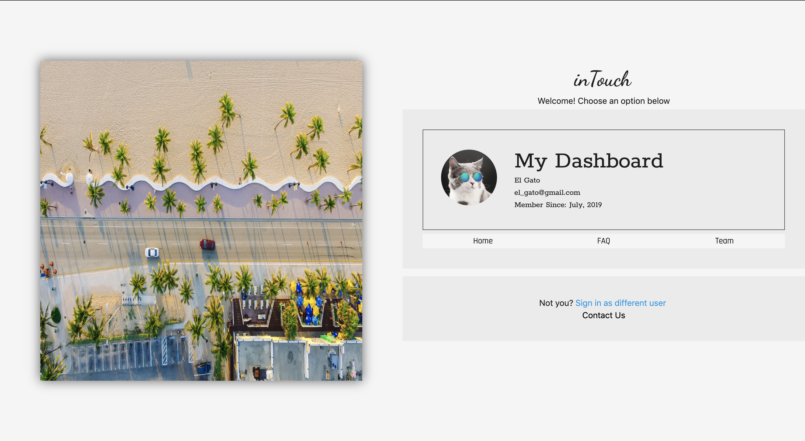
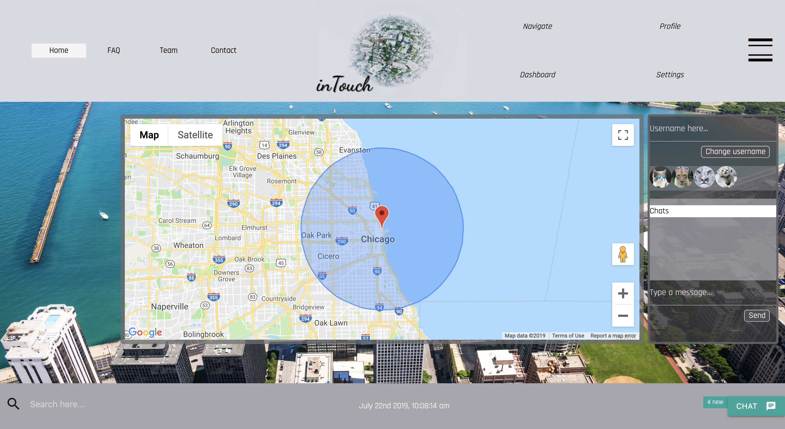

# Project 2 InTouch
Created for project 2 at Northwestern Bootcamp Intouch is a real-time, interactive app that helps parents keep "InTouch" of their children and they're location.  A google maps view of all the childrens location is stored and visualized through a custom made API using Google maps platform, Sequelize, and MySQL database. When a child leaves a set user defined zone inTouch sends a nodemailer alert to the parents email. The family can utilize the built in real-time chat interface using the socketio library allowing for full-duplex chat connection between family members.The app's user authentication is handled through OKTA a cloud based access management system.
[Deployed Github Link :](LINK)
[Heroku Link :](LINK)
## Screen Shots
Register

Sign In

Dashboard

Homepage

Google Maps
## Technologies used
- [Node.js](https://en.wikipedia.org/wiki/Node.js)
- [Materialize Framework](https://materializecss.com/)
- [Sequelize](http://docs.sequelizejs.com/)
- [MySQL](https://en.wikipedia.org/wiki/MySQL)
- [Express.js Framework](https://expressjs.com/)
- [Handlebars](https://handlebarsjs.com/)
- [MVC -architecture](https://en.wikipedia.org/wiki/Model%E2%80%93view%E2%80%93controller)
- [NPM packages](https://www.npmjs.com/)
- [OKTA authentication](https://www.okta.com/products/adaptive-multi-factor-authentication/)
- [Socketio Library](https://socket.io/)
- [Nodemailer](https://nodemailer.com/about/)
- [Google Maps API](https://cloud.google.com/maps-platform/)
### To Run App
- Go to Terminal in VS Code command line input: npm install
- To run App : nodemon .bin/www
- Go to localhost3000:/oktadash 
- Register new user

**Joey Langsangan** - /Materialize/HTML/CSS/Frontend Visual Design - [Joey](LINK)
**Sung Lee** - /OKTA Authentication/SocketIO/NPM Packages - [Sung](LINK)
**Kat Poulos** - /Sequelize MySQL/Google API/Nodemailer/Backend JS - [Kat](LINK)

this is the readme file....feel free to make any updates guys!